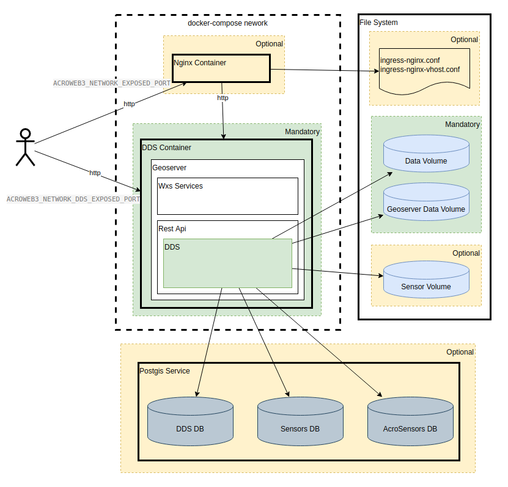

# DDS Installation guide

## System Description

DDS is an extension of the geoserver REST Api. Its main goal is to create and manage WxS layers from time dependent data.

The following schema describes the main components of the system end the interactions between them.

Here is a brief description of the components:

 - DDS Container: an Apache Tomcat application server to run the Geoserver application with the DDS extension installed
 - Nginx Container: an Nginx web server simply to proxy each request to the Geoserver. This should only be used when it is necessary to set a TLS termination for https requests. Otherwise each request can be handled directly by the geoserver
 - Data Volume: volume/directory where data will be stored
 - Geoserver Data Volume: volume/directory containing the Geoserver data directory (workspaces, layers, styles) and the DDS configuration files (ddsData directory)
 - Sensor Volume (Optional): volume/directory containing the sensors registry database files (sqlite3 db)
 - DDS DB (Optional): database used to store the configured thresholds 
 - Sensors DB (Optional): database used to store weather stations informations such as:
    - thresholds
    - spatial aggregations
    - sensor groups
 - AcroSensors DB (Optional): database used to store sensors data

## Prerequisites

 - Linux server with installed:
    - docker
    - docker-compose
 - optional:
    - Postgis service

## Installation package

### globals.sh

Bash script file used to configure all environment variables required by the platform:

 - the subnet used by docker 

        export ACROWEB3_DOCKER_SUBNET="192.168.3.0/24"

 - the docker registry used to download the DDS image

        export ACROWEB3_DOCKER_REGISTRY=registry.k8s.cimafoundation.org/

 - the user-id and group-id used to run the containers

        export UID=$(id -u doy) #TODO set
        export GID=$(id -g doy) #TODO set

 - the host directories used as volumes

    - data volume: to contain the data (geotiff, netcdf...)

            export ACROWEB3_VOLUME_DIR_DATA=/data/archive

    - sensors volume: to contain the sensors resgistry data (sqlite db)

            export ACROWEB3_VOLUME_DIR_SENSORS=/data/sensors

    - geoserver data volume: to contain the geoserver data direcotry and the DDS configuration files
            
            export ACROWEB3_VOLUME_DIR_DDSDATA=/data/dds

 - the database connection settings

        export ACROWEB3_PG_HOST=172.17.0.1
        export ACROWEB3_PG_PORT=5432

        export ACROWEB3_PG_ADMIN_USER= #postgres
        export ACROWEB3_PG_ADMIN_PWD= #root

        export ACROWEB3_PG_USER_DDS=${ACROWEB3_PG_ADMIN_USER}
        export ACROWEB3_PG_USER_SENSORS=${ACROWEB3_PG_ADMIN_USER}
        export ACROWEB3_PG_USER_ACROSENSORS=${ACROWEB3_PG_ADMIN_USER}

        export ACROWEB3_PG_PWD_DDS=${ACROWEB3_PG_ADMIN_PWD}
        export ACROWEB3_PG_PWD_SENSORS=${ACROWEB3_PG_ADMIN_PWD}
        export ACROWEB3_PG_PWD_ACROSENSORS=${ACROWEB3_PG_ADMIN_PWD}

 - the exposed ports in the host server (for both nginx an tomcat)

        export ACROWEB3_NETWORK_DDS_EXPOSED_PORT=8080
        export ACROWEB3_NETWORK_EXPOSED_PORT=80

 - the DDS container version

        export ACROWEB3_VERSION_DDS=2.4.3

 - the memory settings for Geoserver

        export ACROWEB3_DDS_INITIAL_MEMORY=1G
        export ACROWEB3_DDS_MAXIMUM_MEMORY=2G

### docker-compose-dds.yml

yaml file for the DDS service definition

### docker-compose-ingress.yml

yaml file for the nginx service definition

### docker-compose-network.yml

yaml file for the network definition

### compose-dds.sh

Bash script used for the service execution and management. Here are defined the services that will be run: i.e. if you need to run only DDS (without the nginx) you must remove the ingress service from the line

    SERVICES="DDS network ingress"

To execute as a service:

    cd [installation-dir]
    ./compose.dds.sh up -d

To stop the service

    cd [installation-dir]
    ./compose.dds.sh down

To view the logs

    cd [installation-dir]
    ./compose.dds.sh logs dds -f

### ingress-nginx.conf

conf file for nginx service

### ingress-nginx-vhost.conf

conf file for dds virtual host in nginx service. This must be configured with TLS certificates anche server name

### archive.tgz

tar archive with example data

### data.tgz

tar archive for "base" geoserver data direcotry and dds configuration files

## DDS Configuration

The figure below shows the Data Server architecture

... <Inserire immagine>
 
DDS can supply two main data types:

 - Maps (or Layers): any information layer that can be published using WxS services and loaded on a map control
 - Series: single or multiple sequence of data that, usually, can be plotted in a chart
 
### Map data
The map data configuration files are stored in the Geoserver Data Volume, in the subfolder:

        ACROWEB3_VOLUME_DIR_DDSDATA/ddsData/etc/map
  
which should contain these files:

 - <layer_settings>.xml: xml file configuring a supported data type;
 - Components.properties: contains a specific map component (Java class) for each xml layer settings file;
 - Description.properties: contains a dedicated description for each xml layer settings file.

To add map data to the local DDS instance, the associated xml configuration files must be added to the /map folder.
There must be an xml configuration file for each configured map data! 
The configuration contains information about the physical locations of the data files, the variables included, the timeline, the levels and the palette and even time and spatial aggregation options.
An example of configuration file is illustrated below (TRMM satellite images).

        <dynamicLayer descr="TRMM" id="TRMM">
          <attribute descr="Variable" id="variable" type="List">
            <attributeEntry default="1" descr="precipitation depth" id="precipitation;0">
              <referredValue id="paletteId" value="ACR4Rain"/>
            </attributeEntry>
          </attribute>
          <attribute descr="Cumulative Range" id="aggregation" type="List">	
            <attributeEntry descr="last 3 h" id="3"/>
            <attributeEntry descr="last 6 h" id="6"/>
            <attributeEntry descr="last 12 h" id="12"/>
            <attributeEntry default="1" descr="last 24 h" id="24"/>
            <attributeEntry descr="last 48 h" id="48"/>
            <attributeEntry descr="last 72 h" id="72"/>
          </attribute>
        </dynamicLayer>

 - The 'id' attribute of the <dynamicLayer> tag must match the name of the .xml file;
 - The <dynamicLayer> tag may contain a set of <attribute> tags, each containing the following attributes:
    - id: identifier of the attribute (e.g. "variable"); 
    - descr: a short description;
    - hidden: sets if the attribute is visible or not in the Dewetra Layer Properties. True (hidden) by default;
    - type: sets the attribute Type (Text or List).
 - Each <attribute> tag may contain a set of <attributeEntry> tags, each containing the following attributes:
    - id: identifier of the attribute entry (e.g. "precipitation;0", that is name and level of the variable);
    - descr: a short description;
    - default: sets the default value.
  - Each <attributeEntry> tag may contain a set of <referredValue> tags, each containing the following attributes:
    - id: identifier of the referred value (e.g. "paletteId");
    - value: the specific value (e.g. "ACR4Rain", the Geoserver style name of the Dynamic Layer Palette).
 
Each map data is handled by a specific map component. The component to be used for a particular data is declared in the component.properties file, contained in the /map folder. Below is the component.properties file entry for TRMM satellite data:

        TRMM = com.acrotec.data.dds.components.DDSMapSatTRMMComponent

The name on the left must be the same as the xml file. The string on the right is the fully qualified name of the Java class that implements the component.
The description.properties file, also contained in the /map folder, instead, is used to give a user-friendly description of the data. Here is description.properties file entry for TRMM satellite data:

        TRMM = TRMM satellite images

#### Coverage data
Data of type 'coverage' (e.g. WRF meteo model), in addition to standard xml settings files stored in the folder /map, require a specific coverage settings files (.xml) containing information for accessing the native data (e.g. NetCDF files) stored in the DDS Data Volume.
The coverage settings file must have the same name as the coverage file (for WRF coverage data, WRF.xml) and must be stored in the subfolder: 
 
        ACROWEB3_VOLUME_DIR_DDSDATA/ddsData/etc/map/coverage 
 
The coverage file has the following syntax:

        <coverage name="WRF" component="com.acrotec. data.dds.coverage.managers.NetcdfCoverageManager">
          <attribute name="dir" value = "<path_to_data_files>"/>
          <attribute name="description" value="WRF"/>
          <attribute name="filename" value="wrfout"/>
        </coverage>
 
 where:
 
 - The 'name' attribute of the <coverage> tag must contain the name of the data, which is also the name of the .xml file;
 - The 'value' attribute of the <attribute> tag with name = "dir" must contain the absolute path to the source files;
 - The 'value' attribute of the <attribute> tag with name = "filename" must contain the initial characters of the source file name. 
 
  ### Series data
The series data configuration files are stored in the Geoserver Data Volume, in the subfolder:

        ACROWEB3_VOLUME_DIR_DDSDATA/ddsData/etc/series
  
To add series data to the local DDS instance, the associated .properties configuration files must be added to the /series folder.
There must be a .properties file for each configured series data! 
This file contains information about the series, the physical locations of the data files or the connection parameters to the source database and the specific chart components to plot the series. Below is an example .properties file.

        id = geocradle.soilanalysis 
        component = com.acrotec.data.dds.components.serie.geocradle.DDSSerieSoilAnalysisComponent    
        layer = - 
        idfield = s_id 
        descr = - 
        descrfield = s_id 
        type = chemicalAnalysisChart; soilSpectraChart 	// Charts componentes		
        measure = - 
        valuesLabel = - 
        categoriesLabel = - 
        // Parameters of connections to the source DB 
        pgserver = <Host name or IP> 
        pgdb = <db name> 
        pguser = <user>
        pgpassword = <pwd> 

 where:
 
 - The value of 'id' entry must match the name of the .properties file (the string before .properties extension);
 - The value of 'component' entry must contain the dedicated DDS component (fully qualified name of the Java class) to handle the series data;
 - The value of 'type' entry must contain the specific chart components to plot the series.
 
